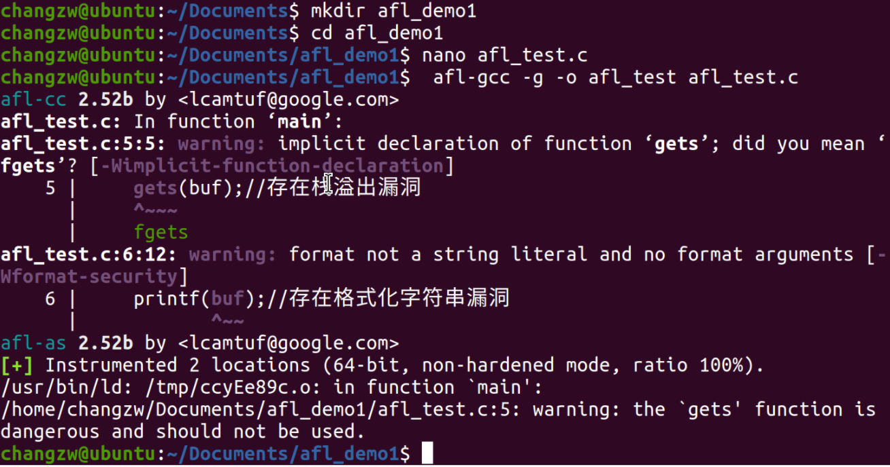
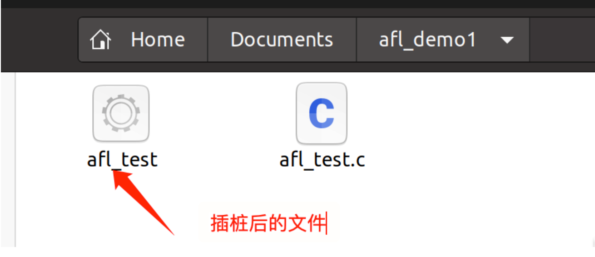
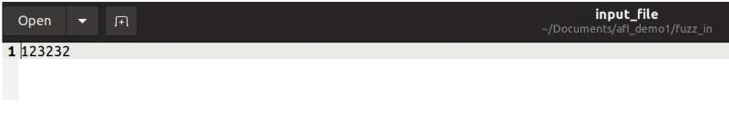
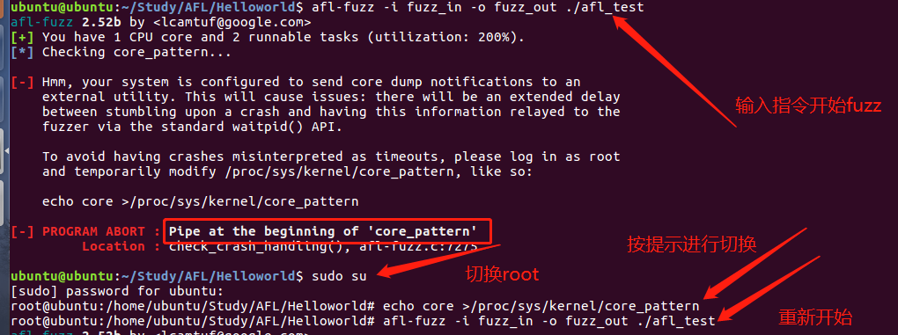
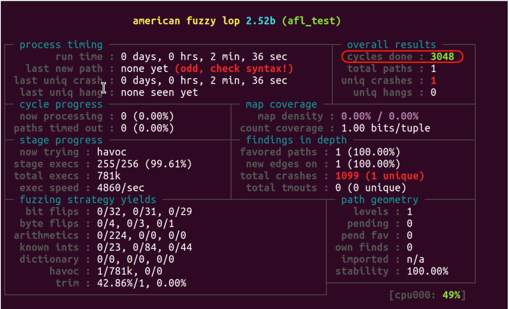

### 第一步 插桩编译测试

1. 新建一个项目文件夹afl_demo1
2. 进入项目文件
3. 写个c程序afl_test.c，准备编译，代码如下：

```
#include <stdio.h> 
int main(int argc, char *argv[])
{
    char buf[100]={0};
    gets(buf);//存在栈溢出漏洞
    printf(buf);//存在格式化字符串漏洞
    return 0;
}
```

4.使用命令 **afl-gcc -g -o afl_test afl_test.c** 编译插桩





### 第二步：开始fuzz

创建两个文件夹，一个做为输入，一个做为输出

在fuzz_in文件夹中创建一个文件input_file作为输入文件，随便输入一点内容



输入指令：**afl-fuzz -i fuzz_in -o fuzz_out ./afl_test** 开始fuzz

这时候应该会出现一些问题



###  解决方案

1.查看报错，发现有个问题，需要 **core_pattern**

2.切换**root**

3.按提示输入指令切换 **echo core >/proc/sys/kernel/core_pattern**

4.重新输入指令 **afl-fuzz -i fuzz_in -o fuzz_out ./afl_test**


当cycles done中的数字变绿时，可以结束 ，CTRL + C 停止




#### 结果分析：https://lcamtuf.coredump.cx/afl/status_screen.txt

https://blog.csdn.net/lady_killer9/article/details/107321319

① Process timing:Fuzzer运行时长、以及距离最近发现的路径、崩溃和挂起经过了多长时间。

② Overall results：Fuzzer当前状态的概述。

cycles done：模糊器遍历到目前为止已发现的所有有趣测试用例，对其进行模糊处理并循环回到最开始的次数

total paths：

uniq crashes：

uniq hangs：

③ Cycle progress：我们输入队列的距离。

now processing：该框告诉您当前队列周期在模糊器的距离：显示当前正在处理的测试用例的ID

path timed out：由于持续超时而决定放弃的输入数量

④ Map coverage：目标二进制文件中的插桩代码所观察到覆盖范围的细节。

map density：已经命中了多少个分支元组，与位图可以容纳的比例成比例。左边的数字描述了当前输入；右边的是整个输入语料库的值

count coverage：处理二进制中元组命中计数的变化。本质上，如果对于我们尝试的所有输入，每个采用的分支始终采用固定的次数，则它将显示为“ 1.00”。当我们设法触发每个分支的其他命中计数时，指针将开始向“ 8.00”移动（8位映射命中的每个位），但可能永远不会达到极限

⑤ Stage progress：Fuzzer现在正在执行的文件变异策略、执行次数和执行速度。

⑥ Findings in depth：有关我们找到的执行路径，异常和挂起数量的信息。

⑦ Fuzzing strategy yields：关于突变策略产生的最新行为和结果的详细信息。

⑧ Path geometry：有关Fuzzer找到的执行路径的信息。

⑨ CPU load：CPU利用率