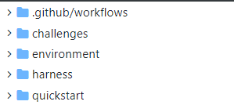
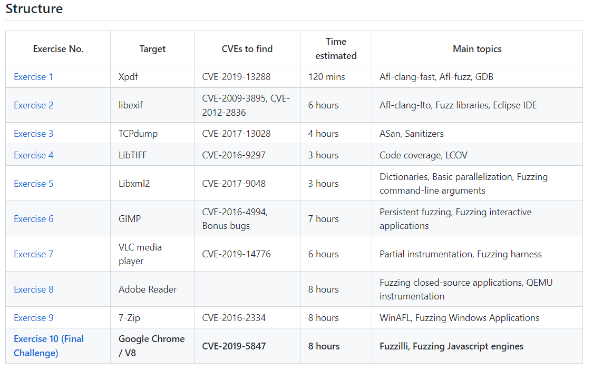

# fuzz

**关于AFL的博客**

https://www.cnblogs.com/wayne-tao/tag/AFL%E5%AD%A6%E4%B9%A0/

**相关论文：**

这方面论文就非常多了，作为新手暂时也不用阅读论文，直接实战就好啦。

**相关项目：**

（虽然都是全英文的教程，但句子写的都比较通俗易懂，推荐直接看，锻炼看英文文档的能力）

**1）**

https://github.com/mykter/afl-training

从零开始介绍模糊测试入门工具AFL/AFL++，适合零基础入门的小白

quickstart---->harness---->challenges 文件夹下的实验难度依次增加

**2）**

https://github.com/antonio-morales/Fuzzing101

使用Fuzz相关工具（AFL++、WinAFL等）完成10个实验，复现已经被发现的cve漏洞

过程非常详细，非常适合在了解AFL后作为上手项目来做

